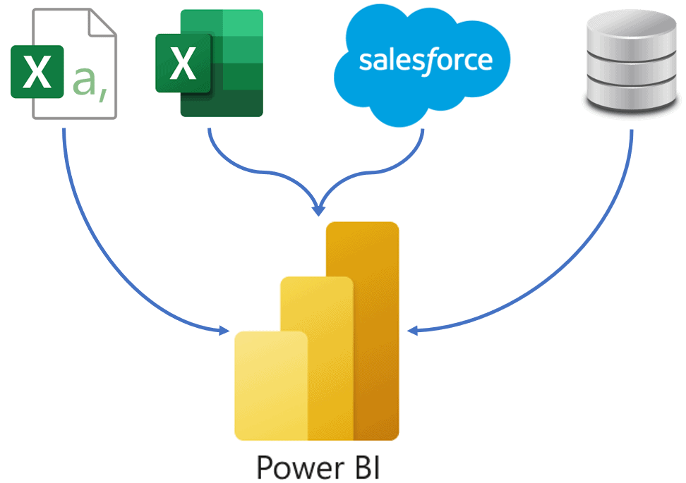

# Data Portfolio:       Top 100 UK Youtubers 2024 (Excel to Power BI)
Somkenechukwu

# Table of contents

- [Objective](https://github.com/somkene-star/somkene-star.github.io/tree/main/assets/docs#objective)
- [Data Source](https://github.com/somkene-star/somkene-star.github.io/tree/main/assets/docs#data-source)
- [Data Set](https://github.com/somkene-star/somkene-star.github.io/commit/f709917b8be1c72ca7cc7075586283efabee272f)
- [Stages](#stages)
- [Design](https://github.com/somkene-star/somkene-star.github.io/blob/main/assets/docs/README.md#design)
    - [Tools](#tools)
- [Development](https://github.com/somkene-star/somkene-star.github.io/blob/main/assets/docs/README.md#development)
   - [Pseudocode](https://github.com/somkene-star/somkene-star.github.io/tree/main/assets/docs#pseudocode)
   - [Data Exploration](#data-exploration)
   - [Transform the Data](#trans-data)
   - [Create the SQL Tests](#sql-test)
- [Testing](#testing)
   - [Data Quality Test](#data-quality-test)
- [Visualization](https://github.com/somkene-star/somkene-star.github.io/commit/b023b2301c3d79bc72bc94317d81f2b68181d80c)
  - [Result](#result)
  - [DAX Measures](#dax-measures)
- [Analysis](#Anaylsis)
  - [Findings](#)
  - [Validation](#validation)
  - [Discovery](#discovery)
- [Recommendations](#recom)
- [Conclusion](#conclusion)

  

